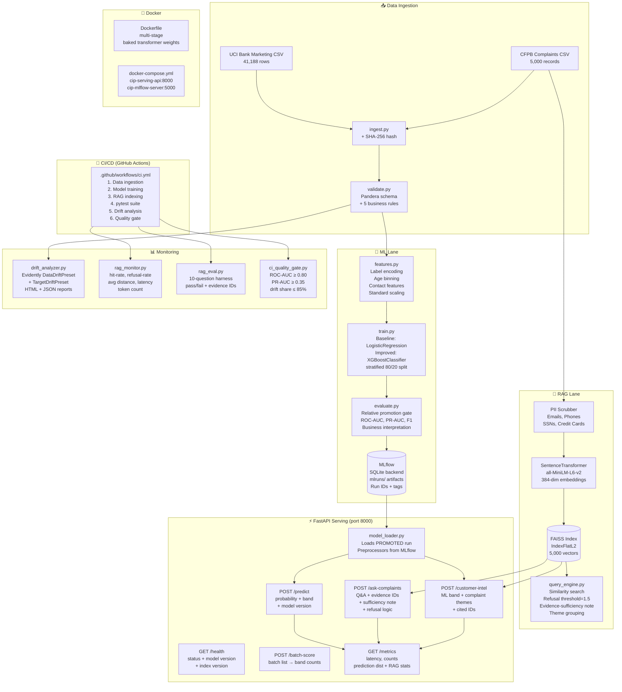

# Customer Intelligence Platform — Architecture

## System Architecture Diagram

---

## Data Flow Summary

| Stage | Input | Output |
|-------|-------|--------|
| Ingestion | Raw URLs (UCI + CFPB API) | CSVs + SHA-256 hashes |
| Validation | Raw CSV | Pandera schema pass/fail |
| Feature Engineering | Raw bank columns | 23 encoded + scaled features |
| Training | Feature matrix | MLflow run IDs + artifacts |
| Promotion Gate | Two run IDs | PROMOTED / BLOCKED status |
| RAG Indexing | CFPB narratives (PII-scrubbed) | FAISS index + metadata.pkl |
| Serving | HTTP JSON requests | Predictions, RAG answers |
| Monitoring | Reference vs. current data | Drift HTML/JSON reports |
| CI Quality Gate | MLflow metrics + drift JSON | Exit 0 (deploy) or Exit 1 (block) |

---

## Component Responsibilities

| Module | Responsibility |
|--------|---------------|
| `src/data_pipeline/ingest.py` | Download datasets, compute SHA-256 |
| `src/data_pipeline/validate.py` | Pandera schema + 5+ business rules |
| `src/data_pipeline/features.py` | Reusable train/serve feature functions |
| `src/training/train.py` | Train LR + XGBoost, log to MLflow |
| `src/training/evaluate.py` | Relative promotion gate |
| `src/serving/model_loader.py` | Load PROMOTED run artifacts |
| `src/serving/app.py` | FastAPI — all 7 endpoints |
| `src/rag/index_builder.py` | PII scrub, embed, build FAISS |
| `src/rag/query_engine.py` | Semantic search, refusal, synthesis |
| `src/rag/rag_eval.py` | 10-question pass/fail eval harness |
| `monitoring/drift_analyzer.py` | Evidently ML drift report |
| `monitoring/rag_monitor.py` | RAG retrieval quality metrics |
| `tests/ci_quality_gate.py` | Automated production deployment gate |
